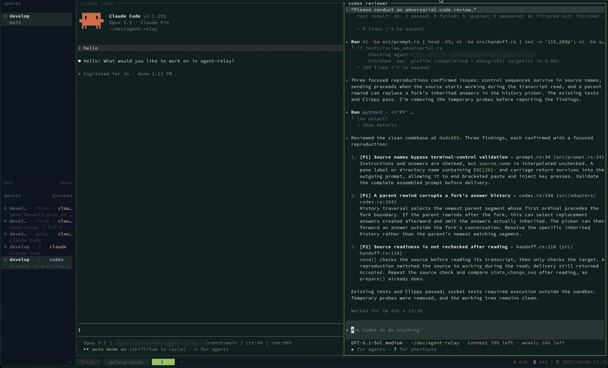

# agent-relay

[](LICENSE)
[](https://herdr.dev/plugins/)

[English](README.md)

[Herdr](https://herdr.dev) で、あるペイン（A）のAIが最後に完了した回答を、指示を添えて別のペイン（B）のAIへ送り、そのまま実行させるプラグインです。
対応しているのは Claude Code と Codex です（A・Bのどちらにも使えます）。ポップアップの表示は英語です。



Codexのレビュー結果を、指示を添えてClaude Codeへ渡しています（送信先を選び、指示を書いて `Enter`）。

## 対応しているエージェントと言語

| エージェント | A（送信元） | B（送信先） | 確認したバージョン |
|---|---|---|---|
| Claude Code | ○ | ○ | 2.1.293（2.1.219 以前はターン完了の記録がないため使えません） |
| Codex CLI | ○ | ○ | 0.160.1、0.161.0。既定の共有daemonでも `--no-daemon` でも使えます |

Herdrが認識するほかのエージェントには対応していません。送信先の一覧には理由つきで出ますが選べず、回答を読み取ることもありません。

| 対象 | 言語 |
|---|---|
| ポップアップ（メニュー・メッセージ） | 英語 |
| Bへ送るプロンプトの、引用の前の一文 | 英語（既定）か日本語。`prompt_language` で切り替え（[設定](#設定)を参照） |
| 入力した指示とAの回答 | どの言語でも可。そのまま送ります（日本語入力を含むUnicode） |
| README | [英語](README.md)、日本語 |

## 使い方

1. A（回答を送りたいAIのペイン）にフォーカスした状態で、割り当てたキーを押します。
2. 画面中央にポップアップが開き、Aの最後の回答を履歴から読み取ります。
3. AIエージェントが動いている他のペインが、別のワークスペースのものも含めてすべて一覧で表示されます（Aと同じタブ、同じワークスペース、他のワークスペースの順。複数のワークスペースにまたがるときはワークスペース名も表示）。送れないペインは理由付き（`working`、`waiting for approval`、`no session yet` など）で表示され、選べません。
   - 上下キー、`Ctrl+p`/`Ctrl+n`、`j`/`k` で移動、`Space` か `1`〜`9` で選択、`Enter` で決定します。
4. 指示を入力します（空のままでも送れます。そのときは引用ラベルと回答だけを送ります）。上部にA→B、回答のサイズ、回答の冒頭が表示されます。
   - `Enter` で送信、`Alt+Enter` で改行、`Ctrl+]` で送り先の選び直し、`Ctrl+o` で送る回答の選択、`Ctrl+r` で最新の回答の再取得、`Esc`／`Ctrl+g`／`Ctrl+q` で終了します（送り先一覧でも同じです）。
   - 日本語入力の確定や、複数行の貼り付けでは送信されません。
   - **過去の回答を送る**：`Ctrl+o` で、Aの回答の一覧（新しい順、最大50件。時刻・1行目・サイズ）が開きます。番号キーか↑↓で選んで `Enter`、`Ctrl+o` で選ばずに戻ります。何も選ばなければ最新の回答を送ります。一覧に出るのは、今の会話の流れにある正常に終わったターンの回答だけです（rewindで巻き戻した分や中断したターンは出ません。最新のターンが中断されていても、それより前の回答は選べます。`/compact` の前の回答も出ます）。
5. 送信の直前に、AとBがまだ同じエージェント・同じセッションで受付可能な状態か、Aの回答が変わっていないかを確かめます。
   最新の回答を送るときは、Aの回答が新しくなっていたら送らずに読み直し、指示は残したまま「The answer was updated」と表示します。
   `Ctrl+o` で選んだ回答は、新しい回答が出ていてもそのまま送ります。ただし、その回答が会話の流れから消えていたら（rewindなど）送りません。
6. Bには、次の形のプロンプトが1回だけ送られ、そのまま実行されます。

   ```
   （入力した指示）

   The following is reference material quoting another AI's answer (from: Claude Code ~/dev/app). The quote is between the separator lines.
   =====
   （Aの回答。原文のまま）
   =====
   ```

   回答の前の一文は既定で英語です。設定の `"prompt_language": "ja"` で「以下は別のAIの回答を引用した参考資料です（送信元：…）。前後の区切り線の間が引用です。」になります。

Herdrが入力を受け付けると、ポップアップはすぐに閉じます。これは受け付けられたことだけを意味するので、Bでの処理の完了はBのペインで確認してください。送信できたか確認できなかったときだけ、警告を表示したまま残ります。

## 「最後の完了した回答」とは

AIのセッション履歴（Claude Code は `~/.claude/projects`、Codex は `~/.codex/sessions`）を読み、最新のターンが正常に終わっている場合の最終回答だけを送ります。
途中経過、thinking、ツールの呼び出しと結果は含めません。範囲を手で選ぶ必要はなく、追加でAIを呼び出すこともしません。

次のときは送らずに理由を表示します。古い回答を代わりに送ることはしません。

- 最新のターンが実行中、中断、失敗、または回答が空
- 履歴の書き込みが終わっていない（最大3秒待ってから判断します）
- Herdrにセッションが登録されていない、履歴が見つからない、同じIDの履歴が複数ある
- 確認していない形式の履歴

## 使える条件と制限

- **A・Bとも、Herdr上で idle か done のとき**に使えます。working・blocked・unknown のペインには送りません。
- **Herdr integration が必要です。** `herdr integration install claude` / `herdr integration install codex` を実行し、エージェントを起動し直してください。
  一覧で `no session yet` と出るときは、次を確認してください。
  - `herdr integration status` で integration が入っているか。
  - Codex は最初の発言をするまでセッションが登録されません。一度何か送ってから使ってください（Bとして使う場合も同じです）。
  - **既定の Codex（共有のバックグラウンドサーバー＝デーモン経由）にも対応しています。** この使い方では Codex の不具合（openai/codex#48500、herdrdev/herdr#4649）で Herdr にセッションが正しく登録されないため、そのペインの端末タイトル（Codex が書く「スレッド名 | プロジェクト」）と作業ディレクトリが、デーモン上のスレッドの1つだけと一致したときに、そのスレッドとして扱います。これが必要なのは、Codex のペインを A（送信元）にして回答を読むときだけです。B（送信先）にするときはペインあてに送り、選んだときと同じ Codex のプロセスが動いているかだけを確かめるので、スレッドに関係なく選べます。A にするときは、次の場合は送りません：最初の発言の前（スレッド名がまだない）、同じディレクトリに同名のスレッドが複数あり、ペインの画面からも見分けられない（Codex は最初の発言からスレッド名を付けるため、どちらも挨拶から始めると同名になります。同名のときは、画面に最新の回答の末尾が見えているスレッドが1つだけなら、それと判断します。見分けられなければ片方で `/rename` してください）、`tui.terminal_title` で端末タイトルの形式を変えている。そのときは `codex --no-daemon` で起動すれば、従来どおり Herdr の登録で動きます。デーモンとのやり取りに使う Codex の app-server の窓口は実験的な扱いのため、Codex の更新で使えなくなる可能性があります。
- **Bの入力欄は空にしておいてください。** 入力欄に書きかけの文字があると、送ったプロンプトの前につながります。このプラグインは入力欄を勝手に消しません。
- **Claude Code で rewind（`Esc` `Esc`）した直後は、次の発言をするまで巻き戻す前の回答が送られます（`Ctrl+o` の一覧にも出ます）。** rewind は履歴に何も残さないため、検出できません。ポップアップのプレビューで内容を確認してください。次の発言をした後は正しい回答を読みます。
- Codex で rewind・fork した直後は、次の発言をするまで「No finished answer」になります。
- Claude Code でスラッシュコマンド（`/model` など）を実行した後は、次の発言をするまで「Cannot confirm the answer is finished」になります（コマンドの記録がターンの後ろに追加されるため）。
- 送信前の確認と送信は一体の操作ではありません。確認の直後にペインが入れ替わる可能性は残ります（Herdrに条件付き送信のAPIがないため）。
- 送信の結果が確認できなかったとき（Herdrとの通信が途中で切れた、時間切れ）は「Could not confirm delivery」と表示します。**二重送信を避けるため、自動で再送はしません。** Bのペインを見て、届いていなければもう一度操作してください。
- 送れる大きさは、指示と回答を合わせて初期値で 256KiB です（Herdr のリクエスト上限は 1MiB）。超えるときは切り詰めずに送信をやめます。Codex への 256KiB 送信は未検証です（64KiB まで確認済み）。
- 回答に端末の制御文字（エスケープシーケンスなど）が含まれていると、Bの端末を誤動作させるおそれがあるため送りません。
- Planモードの Codex のように、最終回答とターン完了の記録が一致しない場合は送りません。
- 同じマシン・同じHerdrサーバーのペインだけが対象です。SSH先・コンテナ内・別ユーザーのセッションは扱いません。
- Herdr ではポップアップを同時に1つしか開けません。

確認した形式とバージョンの詳細は [docs/compatibility.md](docs/compatibility.md) にあります。

## 必要なもの

- Herdr 0.9.3 以降
- Claude Code 2.1.293 / Codex CLI 0.160.1・0.161.0 で確認（[対応しているエージェントと言語](#対応しているエージェントと言語)を参照）
- macOS（動作確認済み）。Linux は未確認です。
- ビルド用に Rust 1.85 以降（`cargo`）

## インストール

```sh
herdr plugin install abroller666/agent-relay
```

Herdrが取得元とビルドコマンド（`sh scripts/build.sh`。中で `cargo build --release` を実行）を表示し、確認してから実行します。そのため `cargo`（Rust 1.85 以降）が必要です。リリースを固定するときは `--ref v0.1.0` を付けます。`plugin update` はまだないので、更新するときはもう一度インストールします。

手元に取得して使う場合：

```sh
git clone https://github.com/abroller666/agent-relay.git
cd agent-relay
sh scripts/build.sh      # bin/agent-relay を作ります
herdr plugin link .
```

`~/.config/herdr/config.toml` で、プラグインを開くキーを割り当てます（キーは例です）。

```toml
[[keys.command]]
key = "prefix+h"
type = "plugin_action"
command = "abroller666.agent-relay.open"
description = "hand the last answer to another pane"
```

`herdr server reload-config` を実行すると反映されます。

## 設定

プラグインの設定ディレクトリ（`HERDR_PLUGIN_CONFIG_DIR`）に `config.json` を置くと、引用の前の一文の言語や、Claude Code・Codex の履歴の探索先（標準以外の場所にしている場合）を変えられます。
ポップアップの環境変数はAIの環境と同じとは限らないため、`CLAUDE_CONFIG_DIR` などは読みません。

```json
{
  "claude_roots": ["~/.claude/projects"],
  "codex_roots": ["~/.codex/sessions"],
  "max_payload_bytes": 262144,
  "max_file_bytes": 268435456,
  "max_line_bytes": 8388608,
  "max_candidates": 10000,
  "prompt_language": "en"
}
```

どの項目も省略できます。知らない項目があるとエラーになります。
`prompt_language` は送るプロンプトの引用の前の一文の言語で、`"en"`（既定）か `"ja"` です。ポップアップの表示は英語のままです。

## データの扱い

- 履歴は読むだけで、書き込みません。
- 起動ごとに状態ファイル（回答と指示を含む）をプラグインの状態ディレクトリに作り、ポップアップを閉じると削除します。ファイルは 0600、ディレクトリは 0700 です。異常終了で残ったファイルは、24時間後に次の起動時に削除します。
- 回答や指示をログには出しません。

## 開発

```sh
cargo test
cargo clippy --all-targets -- -D warnings
sh scripts/build.sh   # 変更後に再ビルドすると、次に開いたポップアップから反映される
```

`tests/fixtures/raw/` はテスト用セッションの履歴を `tests/fixtures/sanitize.py` で縮約したものです。

キー操作と一覧の表示は [broadcast-pane](https://github.com/abroller666/broadcast-pane)（MIT）を参考にしています。

## ライセンス

MIT
